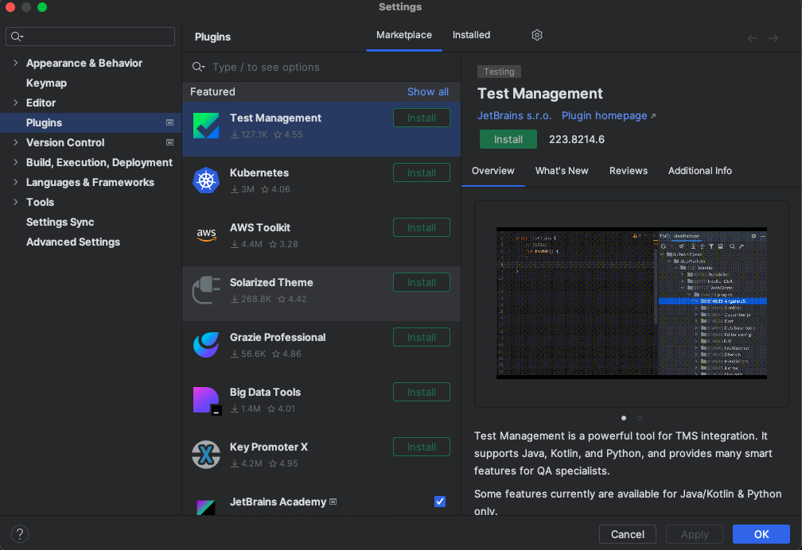
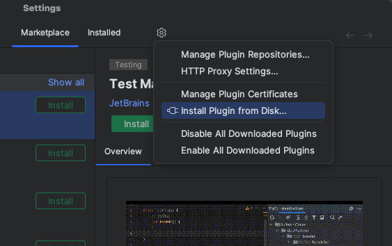
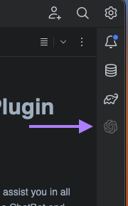
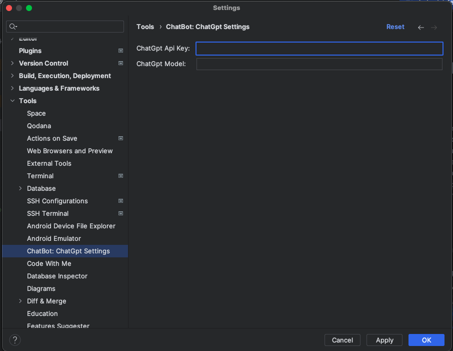
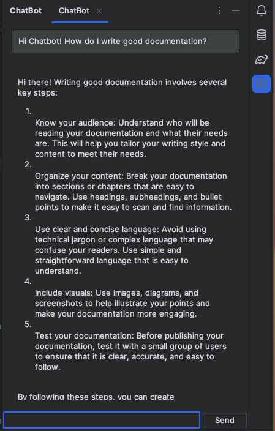
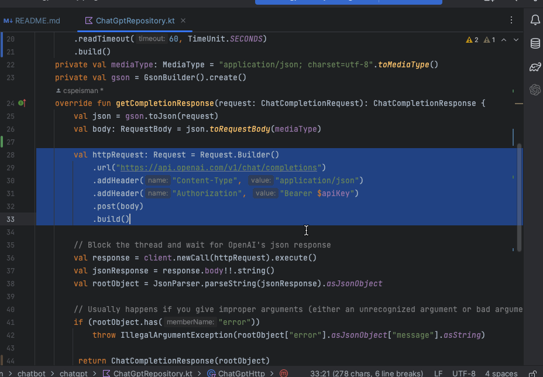
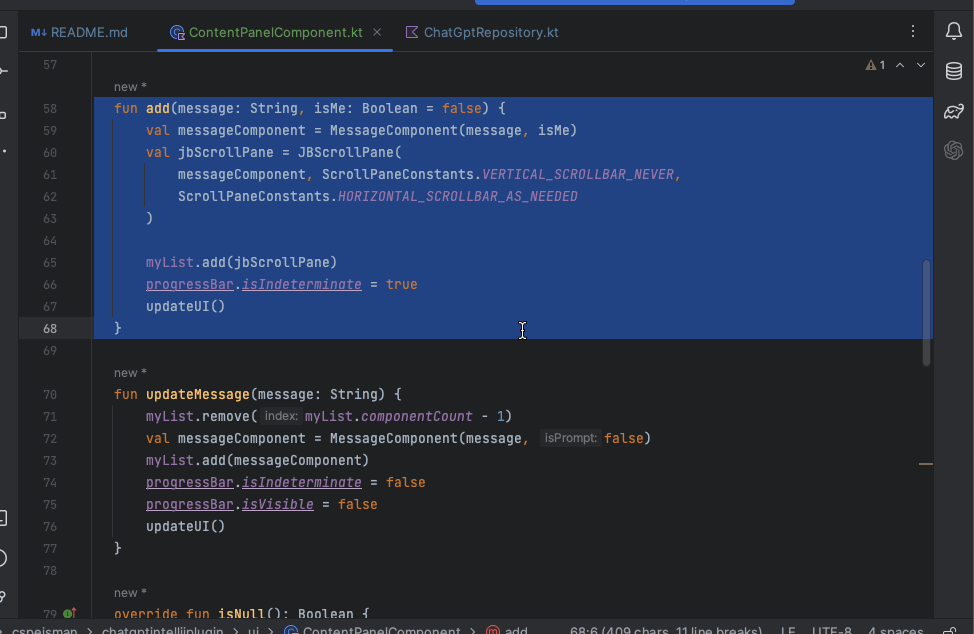

# Corey's ChatBot Intellij Plugin

## Overview
<!-- Plugin description -->
The ChatBot plugin uses ChatGPT underneath the hood to assist you in all (okay, some) of your coding needs.
You can interact with the ChatBot and ask it any questions you would like, even those not coding related.
Additionally, you can fire intellij actions to `Ask Chatbot about this code` which will explain your highlighted block of code
or `Ask Chatbot to refactor this code` which will offer up a refactor suggestion for your highlighted block of code.
<!-- Plugin description end -->

## Installation
1. Download the plugin's zip file [coreys-chatgpt-intellij-plugin-0.0.1.zip](coreys-chatgpt-intellij-plugin-0.0.1.zip) in the repository
2. Go to your plugins planel in the settings modal
  
 
3. Click on the Gear Icon in the right most tab and select "Install Plugin from Disk..."
   
 

4. From there you can upload the downloaded zip file
5. Confirm that you see the ChatBot Icon in the right panel and you are good to go!

 

## Setup
Now that the plugin is installed you need you add your ChatGPT api key 

- Navigate to the settings page at **Tools -> ChatBot: ChatGpt Settings** and paste in your api key from [OpenAI](https://platform.openai.com/account/api-keys)
- **OPTIONAL:** If you have a preferred model you would like to use, you can include it here. Otherwise ChatBot will use `gpt-3.5-turbo` by default
  

---

## Features
**General Questions:** Clicking on the ChatBot icon on the right side toolbar will open the ChatBot panel where you can have open dialog with the chatbot using the text field

**Ask ChatBot To Explain:** You can highlight a block of code and open the actions window and type "Ask ChatBot To Explain". ChatBot will take the highlighted code and give its best explanation 

**Ask ChatBot To Refactor:** You can highlight a block of code and open the actions window and type "Ask ChatBot To Refactor". ChatBot will take the highlighted code and respond with a refactored solution. You can use the "Replace Selection" button to replace your highlighted code with the refactored suggestion

---
Plugin based on the [IntelliJ Platform Plugin Template][template].

[template]: https://github.com/JetBrains/intellij-platform-plugin-template
